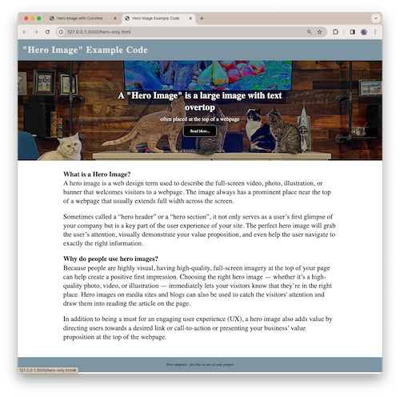

*Template:*
# Hero Image Homepage

### What is a Hero Image?
A hero image is a web design term used to describe the full-screen video, photo, illustration, or banner that welcomes visitors to a webpage. The image always has a prominent place near the top of a webpage that usually extends full width across the screen.

Sometimes called a “hero header” or a “hero section”, it not only serves as a user’s first glimpse of your company but is a key part of the user experience of your site. The perfect hero image will grab the user’s attention, visually demonstrate your value proposition, and even help the user navigate to exactly the right information.

### Why do people use hero images?
Because people are highly visual, having high-quality, full-screen imagery at the top of your page can help create a positive first impression. Choosing the right hero image — whether it’s a high-quality photo, video, or illustration — immediately lets your visitors know that they’re in the right place. Hero images on media sites and blogs can also be used to catch the visitors' attention and draw them into reading the article on the page. 

In addition to being a must for an engaging user experience (UX), a hero image also adds value by directing users towards a desired link or call-to-action or presenting your business’ value proposition at the top of the webpage.

---
### Hero Image
` hero-only.html ` - 
This is an example of a homepage that contains a large hero image below the header. 

---

### Hero Image and Columns

` hero-3column.html ` - 
This is has the hero image below the header, but it also has a 3-column layout below the hero image. Each column contains an image and a heading before its content, but you can eaily change that for your page. 

---

Students are free to clone this template repository for their own projects. However, if you do use this code it must be clearly modified from its original form. It should be customized for your own site, not merely copied and pasted from these starter files. 
